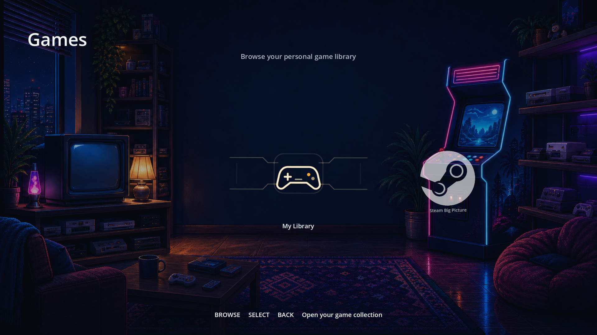
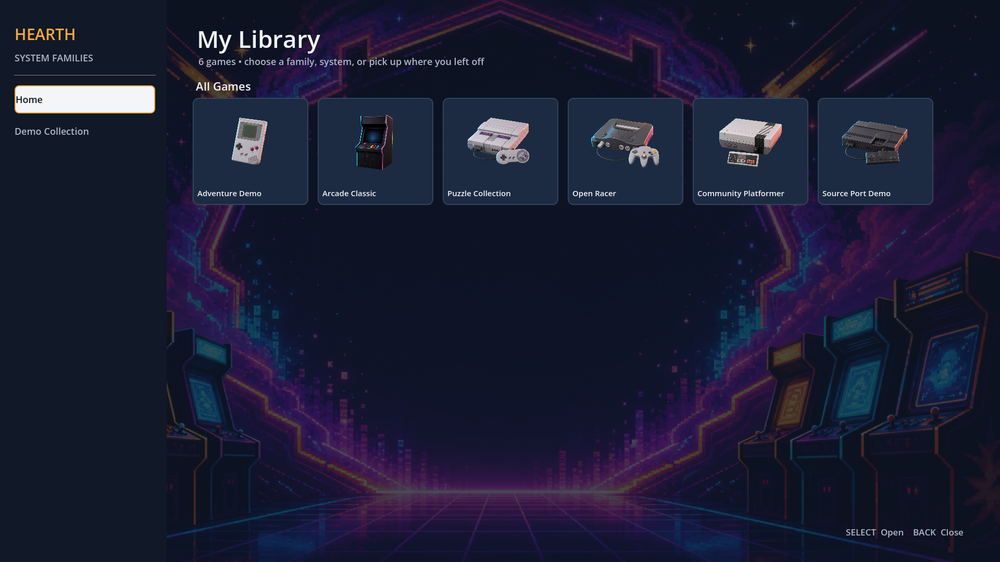
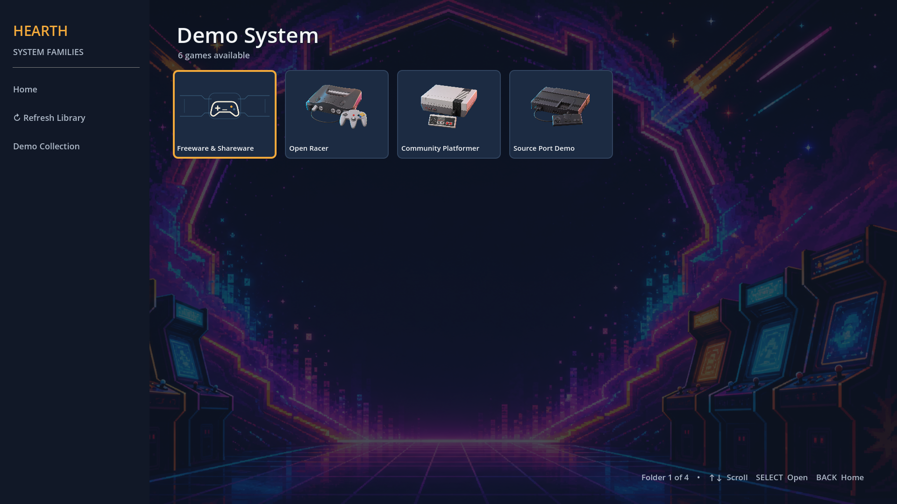
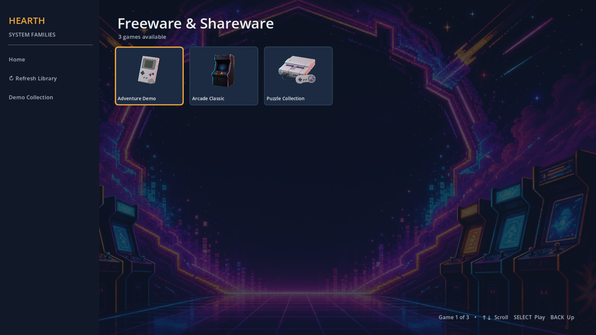
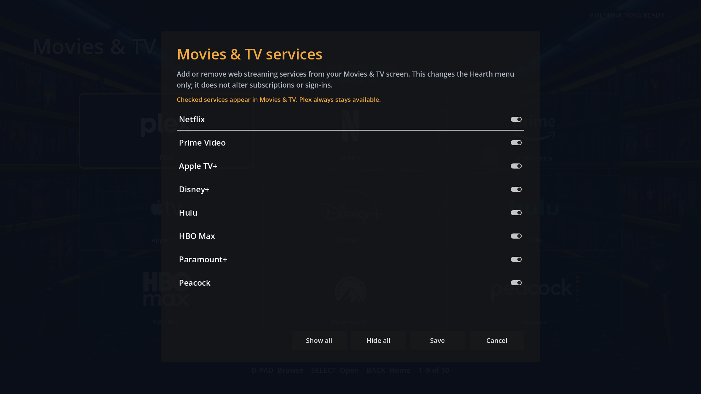
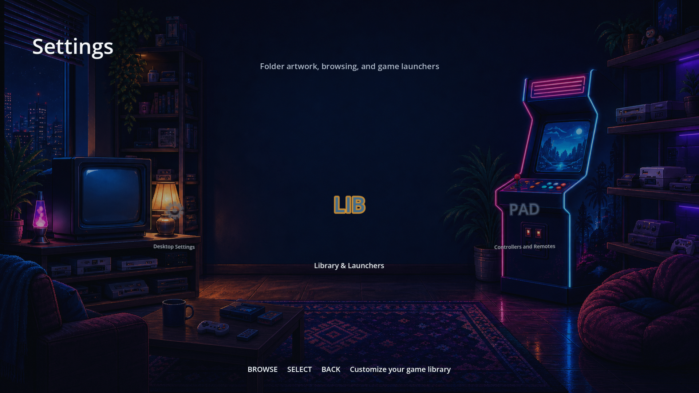
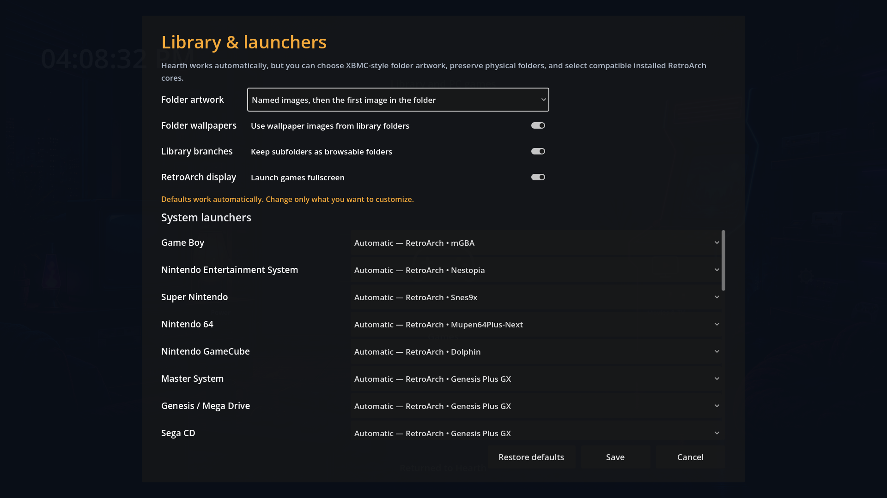
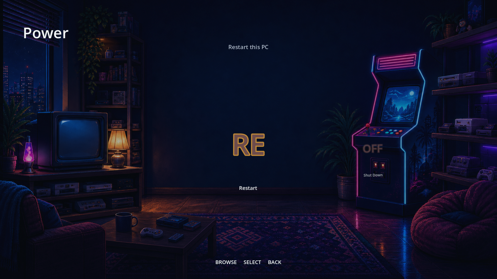
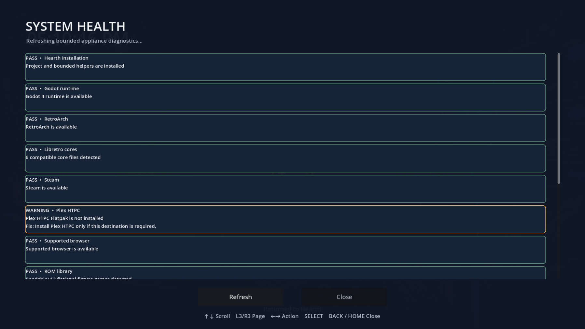

# Hearth Media Center


[](https://github.com/ppeck1/hearth-media-center/actions/workflows/verify.yml)

Hearth is a controller-first home screen for a living-room PC. It puts personal games, Steam Big Picture, Plex, streaming services, settings, and power controls behind one simple interface.

> **Alpha status:** the software has portable automated verification and Fedora lifecycle tooling, but the dedicated-PC [hardware matrix](docs/hardware-validation.md) has not been run and a redistribution license has not been selected. Treat this as an internal alpha, not a finished household appliance.


## Start here

The Home screen has four destinations:

1. **Games** — browse the local library or open Steam Big Picture.
2. **Movies & TV** — open Plex or a streaming service from a scrollable 3×3 grid.
3. **Settings** — customize library folders, launchers, controllers, remotes, and desktop settings.
4. **Power** — restart or shut down the appliance.

Hearth is designed to work from a controller or ordinary remote. Arrow keys, Enter, Escape, and Home remain available as recovery controls.

## Interface tour

### Games

<table>
  <tr>
    <td width="50%"></td>
    <td width="50%"></td>
  </tr>
  <tr>
    <td align="center"><strong>Choose My Library or Steam</strong></td>
    <td align="center"><strong>One-page library overview</strong></td>
  </tr>
  <tr>
    <td></td>
    <td></td>
  </tr>
  <tr>
    <td align="center"><strong>Systems remain one scrollable page</strong></td>
    <td align="center"><strong>Physical folders become browsable branches</strong></td>
  </tr>
</table>

The screenshot catalog uses fictional entries. Personal ROM names and local media inventories are never stored in this repository.

### Movies & TV

<table>
  <tr>
    <td width="50%"></td>
    <td width="50%"></td>
  </tr>
  <tr>
    <td align="center"><strong>Nine destinations visible at once</strong></td>
    <td align="center"><strong>Add or remove services without editing files</strong></td>
  </tr>
</table>

### Settings and power

<table>
  <tr>
    <td width="50%"></td>
    <td width="50%"></td>
  </tr>
  <tr>
    <td align="center"><strong>All configuration starts in Settings</strong></td>
    <td align="center"><strong>Folder and launcher choices</strong></td>
  </tr>
  <tr>
    <td></td>
    <td></td>
  </tr>
  <tr>
    <td align="center"><strong>Editable controller and remote profiles</strong></td>
    <td align="center"><strong>Power controls stay on the main screen</strong></td>
  </tr>
</table>

All screenshots are rendered directly from the Godot project at 1920×1080 by [`capture_readme_screenshots.gd`](launcher/tests/capture_readme_screenshots.gd). The library screenshots use a privacy-safe fixture.



**System Health shows bounded status and remediation without personal inventory.**

## Add a personal game library

Hearth scans `/srv/library/games/roms` whenever **Games → My Library** opens. Choose **Refresh Library** in the library drawer to rescan without leaving it. There is no import database.

Create one top-level folder per system:

```text
/srv/library/games/roms/
├── n64/
├── nes/
├── snes/
├── genesis/
└── gamecube/
```

Subfolders are preserved:

```text
/srv/library/games/roms/n64/
├── icon.png
├── wallpaper.jpg
├── Multiplayer/
│   ├── icon.webp
│   ├── wallpaper.png
│   └── Example Game.z64
└── Example Adventure.z64
```

The two canonical media files are:

| File | Purpose |
| --- | --- |
| `icon.png`, `icon.jpg`, `icon.jpeg`, or `icon.webp` | Tile for that folder or native PC game |
| `wallpaper.png`, `wallpaper.jpg`, `wallpaper.jpeg`, or `wallpaper.webp` | Background while the item or folder is selected |

Names are case-insensitive. Child folders inherit the closest parent wallpaper. Legacy `folder`, `cover`, and `poster` tile names remain compatible.

Game-specific cover art can sit beside a ROM with the same filename stem:

```text
Example Adventure.z64
Example Adventure.png
```

See [Personal ROM library](docs/personal-rom-library.md) for aliases, artwork matching, RetroArch cores, and the native PC manifest.

## Customize Hearth from the couch

Open **Settings → Library & Launchers** to control:

- Smart, full-image, or fill-tile game artwork fitting;
- automatic folder icons;
- automatic `wallpaper.*` backgrounds;
- hierarchical or flat library browsing;
- fullscreen or windowed RetroArch launch;
- installed RetroArch core selection per system.

Open **Settings → Controllers and Remotes** to:

- choose the active input source;
- choose a PS5 or standard-remote profile;
- remap every semantic action;
- test, reset, and save the profile.

Open **Settings → System Health** for a controller-accessible, privacy-bounded summary of the installation, runtimes, library count, input bridge, controller, display session, and launch-at-login service. It cannot run arbitrary commands and never renders personal filenames or credentials.

Movies & TV has its own **Manage Services** tile. It changes the grid immediately and saves the selection locally.

## Controls

| Action | PS5 default | Keyboard or remote default |
| --- | --- | --- |
| Browse | D-pad or left stick | Arrow keys |
| Select | Cross / south face button | Enter |
| Back | Circle / east face button | Escape |
| Previous / next screen or page jump | L1 / R1 or L3 / R3 | Page Up / Page Down |
| Menu | Options | Menu |
| Play / pause | Triangle or touchpad | Media Play/Pause |
| Return to Hearth | PS / Guide | Home |

L1/R1 and L3/R3 currently emit the same semantic `page_left`/`page_right` actions. In Hearth they move by the active view’s page increment; in the Netflix adapter they become Page Up/Page Down for a fast vertical jump. There is no hidden shoulder-versus-stick-click distinction in the current code.

## Run for development

Requirements:

- Godot 4;
- Python 3.11 or newer;
- Bash, `jq`, and `rg` for complete verification;
- `python3-evdev` only for the live Fedora controller bridge.

```bash
git clone https://github.com/ppeck1/hearth-media-center.git
cd hearth-media-center
godot --path launcher
```

The interface runs without ROMs, credentials, or the production filesystem. External applications stay unavailable until their `/opt/hearth/launchers` helpers exist.

## Install on the Fedora appliance

The installer reports required and optional dependencies but does not silently install Steam, RetroArch, Plex, Chrome, or unrelated system software.

```bash
sudo ./deploy/fedora/install.sh --dry-run --godot /path/to/godot
sudo ./deploy/fedora/install.sh --godot /path/to/godot
```

After logging out and back in:

```bash
/opt/hearth/deploy/fedora/doctor.sh
```

Update and uninstall:

```bash
sudo ./deploy/fedora/update.sh --godot /path/to/godot
sudo ./deploy/fedora/uninstall.sh
```

Updates create a timestamped application backup. Uninstall preserves `/srv/library`, Hearth settings, browser profiles, and backups unless the narrow `--remove-settings` option is explicitly used. See [Fedora deployment and rollback](docs/deployment.md) for exact procedures.

### Fedora appliance layout

| Purpose | Path |
| --- | --- |
| Installed project | `/opt/hearth` |
| Godot runtime | `/opt/hearth/runtime/godot` |
| Launch helpers | `/opt/hearth/launchers` |
| Personal ROM library | `/srv/library/games/roms` |
| Native PC catalog | `/srv/library/games/pc/hearth-manifest.json` |
| System Libretro cores | `/usr/lib64/libretro` |

Optional destinations expect:

| Destination | Runtime |
| --- | --- |
| Browser streaming | `/usr/bin/google-chrome-stable` |
| Steam Big Picture | `/usr/bin/steam` |
| RetroArch games | `/usr/bin/retroarch` and installed Libretro cores |
| Plex | Flatpak `tv.plex.PlexHTPC` |
| Desktop and power dialogs | `/usr/bin/zenity` and `systemd` |

## Configuration reference

Start with the [Variable matrix](docs/variable-matrix.md). It lists every supported runtime setting, environment variable, menu field, system-registry field, PC manifest field, input-profile field, default, and storage path.

Primary source-controlled configuration:

| File | Purpose |
| --- | --- |
| [`menu.json`](launcher/config/menu.json) | Home sections, service destinations, settings, and power commands |
| [`system-registry.json`](launcher/config/system-registry.json) | Families, folder aliases, extensions, artwork, and Libretro cores |
| [`input-profiles-defaults.json`](launcher/config/input-profiles-defaults.json) | Built-in PS5 and remote mappings |
| [`app-input-policy.json`](launcher/config/app-input-policy.json) | Destination-to-input-adapter policy |
| [`input-adapters.json`](launcher/config/input-adapters.json) | Allowlisted semantic outputs |

Local UI settings are stored below `${XDG_CONFIG_HOME:-$HOME/.config}/hearth` and are written atomically.

## How application launching stays bounded

- RetroArch receives only an installed `*_libretro.so` filename and a ROM below `/srv/library/games/roms`.
- Native PC manifest entries may call only helpers below `/opt/hearth/launchers`.
- Streaming and Plex run through a short-lived input bridge that releases devices on exit, failure, or disconnect.
- The bridge emits only configured, allowlisted keys and never runs as root.
- Browser profiles, credentials, ROMs, BIOS files, saves, and media inventory stay outside the repository.

The complete component flow and trust boundaries are in [Architecture](docs/architecture.md):

```text
controller / remote
  → Godot Hearth
  → validated helpers
  → RetroArch, approved native apps, Steam, Plex, or browser
  → optional unprivileged input bridge
  → return to Hearth
```

## Verify a change

Run everything:

```bash
HEARTH_GODOT=/opt/hearth/runtime/godot ./verify/verify-project.sh --ci
```

Or run individual suites:

```bash
godot --headless --path launcher --import
godot --headless --path launcher --script res://tests/input_smoke.gd
godot --headless --path launcher --script res://tests/library_smoke.gd
godot --headless --path launcher --script res://tests/library_browser_smoke.gd
godot --headless --path launcher --script res://tests/library_settings_smoke.gd
godot --headless --path launcher --script res://tests/system_health_smoke.gd
godot --headless --path launcher --script res://tests/activity_store_smoke.gd
python3 -m unittest discover -s input_bridge/tests
python3 -m unittest discover -s deploy/fedora/tests
```

The complete verifier checks JSON and configuration relationships, artwork references, executable modes, shell syntax, privacy boundaries, bridge behavior, atomic settings persistence, folder media discovery, documentation links, repository cleanliness, and Godot scene parsing.

Verification is intentionally separated:

| Class | How to run | What it means |
| --- | --- | --- |
| CI-safe | `./verify/verify-project.sh --ci` | Portable source, Python, Godot, docs, launcher, settings, and privacy checks |
| Fedora-only | `/opt/hearth/verify/verify-project.sh --fedora` | CI-safe suite plus live appliance diagnostics |
| Hardware-only | [Hardware validation](docs/hardware-validation.md) | Physical controller, TV, audio, suspend, launch/exit, and power evidence; never auto-passed |

## Maintainer documentation

- [Fedora installation, update, uninstall, and rollback](docs/deployment.md)
- [Hardware validation matrix](docs/hardware-validation.md)
- [Troubleshooting and privacy-safe logs](docs/troubleshooting.md)
- [Architecture and trust boundaries](docs/architecture.md)
- [Variable matrix](docs/variable-matrix.md)
- [Demonstration capture](docs/demo.md)
- [v0.1.0-alpha release draft](docs/releases/v0.1.0-alpha.md)
- [Contributing](CONTRIBUTING.md)

## Current limitations

- Fedora is the only production deployment target; other distributions are untested and unsupported.
- USB and Bluetooth identities still require validation on each target controller/remote combination.
- Streaming behavior depends on external sites, applications, and active subscriptions.
- GNOME Wayland cannot guarantee a persistent overlay above every fullscreen application.
- The physical hardware matrix remains unrun for this alpha preparation.
- [No redistribution license has been selected](LICENSE); copyright remains reserved until the maintainer decides.

Brand names and service marks belong to their respective owners and are used only to identify compatible destinations.
