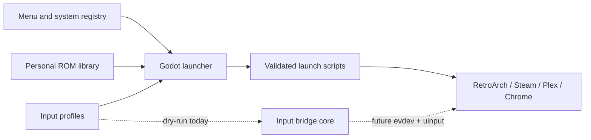

# Hearth Media Center


**A controller-first living-room launcher for personal games, local media, PC gaming, and streaming services.**

Hearth is a Godot 4 interface designed for a dedicated Fedora/Wayland media PC. It provides one cinematic, couch-friendly home screen while leaving emulation, media playback, PC gaming, and browser streaming to the applications built for them.


## What Hearth does

- Presents destinations in a wrap-around, controller-driven carousel.
- Discovers a personal ROM library and organizes known folder aliases into console families.
- Launches RetroArch games only through configured Libretro cores and validated library paths.
- Opens Steam Big Picture, Plex HTPC, and isolated Chrome app profiles for streaming services.
- Returns focus to Hearth after a launched application exits.
- Provides editable PS5 DualSense and standard-remote input profiles.
- Keeps Arrow keys, Enter, and Escape available as recovery controls.
- Stores runtime profiles locally; no credentials, ROM inventory, or personal media data belongs in the repository.

## Interface

<table>
  <tr>
    <td width="50%"></td>
    <td width="50%"></td>
  </tr>
  <tr>
    <td align="center"><strong>Streaming destinations</strong></td>
    <td align="center"><strong>Controller and remote profiles</strong></td>
  </tr>
</table>

The screenshots are captured directly from the Godot project at 1920x1080 using [`capture_readme_screenshots.gd`](launcher/tests/capture_readme_screenshots.gd).

## Project status

| Area | Status |
| --- | --- |
| Godot launcher and carousel | Implemented and smoke-tested |
| ROM discovery and RetroArch launch validation | Implemented |
| PS5 / standard remote mapping UI | Implemented and smoke-tested |
| Backend-neutral translation core | Implemented with deterministic replay tests |
| Cross-application `evdev` / `uinput` service | Not activated; requires target Fedora hardware QA |
| Turnkey Fedora installer | Not included; deployment contract is documented below |

Hearth is designed for the Fedora appliance described here, but the new controller profiles and cross-application bridge have not yet been validated with the final USB/Bluetooth hardware on that PC.

## Controls

| Action | PS5 default | Keyboard / remote default |
| --- | --- | --- |
| Browse | D-pad or left stick | Arrow keys |
| Select | Cross / south face button | Enter |
| Back | Circle / east face button | Escape |
| Previous / next page | L1 / R1 | Page Up / Page Down |
| Menu | Options | Menu |
| Hearth home | PS / Guide | Home |

Open **Settings**, choose an input source and profile, then select **Remap** beside an action. Profiles can be tested, reset, and saved without editing project files. Runtime settings are written to:

```text
${XDG_CONFIG_HOME:-$HOME/.config}/hearth/input-profiles.json
```

Controllers of the same SDL type currently share their Godot-side profile. Stable per-device Linux identities will be added with the Fedora input service.

## Architecture



The input implementation is intentionally split into small responsibilities:

- [`input_actions.gd`](launcher/scripts/input/input_actions.gd) defines semantic actions.
- [`input_event_codec.gd`](launcher/scripts/input/input_event_codec.gd) converts Godot events into canonical controls.
- [`input_profile_store.gd`](launcher/scripts/input/input_profile_store.gd) validates and persists profiles safely.
- [`input_manager.gd`](launcher/scripts/input/input_manager.gd) matches devices and routes actions.
- [`input_settings.gd`](launcher/scripts/settings/input_settings.gd) owns the settings and capture workflow.
- [`input_bridge/`](input_bridge/) contains the non-privileged Python translation core and replay tests.

## Quick start for development

Prerequisites:

- Godot 4
- Python 3.11 or newer
- Bash, `jq`, and `rg` for the complete Linux verification script

Clone the repository and start the launcher:

```bash
git clone https://github.com/ppeck1/hearth-media-center.git
cd hearth-media-center
godot --path launcher
```

The interface can be developed without ROMs, streaming credentials, or the production Fedora filesystem. Application launch commands will remain unavailable unless the `/opt/hearth` deployment contract is present.

## Fedora deployment contract

Hearth currently uses a deliberate fixed appliance layout rather than an installer:

| Purpose | Path |
| --- | --- |
| Installed project | `/opt/hearth` |
| Godot runtime | `/opt/hearth/runtime/godot` |
| Launch helpers | `/opt/hearth/launchers` |
| Personal ROM library | `/srv/library/games/roms` |
| Fedora Libretro cores | `/usr/lib64/libretro` |

A minimal manual deployment looks like:

```bash
sudo install -d /opt/hearth/runtime
sudo cp -a launcher launchers /opt/hearth/
sudo install -m 0755 /path/to/godot /opt/hearth/runtime/godot
sudo chmod +x /opt/hearth/launchers/*.sh
/opt/hearth/launchers/hearth.sh
```

`hearth.sh` starts Godot with the Wayland display driver at 1920x1080. Optional destinations require their corresponding software:

| Destination | Runtime expectation |
| --- | --- |
| Browser streaming | `/usr/bin/google-chrome-stable` |
| Steam | `/usr/bin/steam` |
| RetroArch | `/usr/bin/retroarch` and compatible cores in `/usr/lib64/libretro` |
| Plex HTPC | Flatpak application `tv.plex.PlexHTPC` |
| Maintenance and power dialogs | `/usr/bin/zenity` |
| Restart / shutdown | `systemd` |

Streaming accounts, browser profiles, ROMs, BIOS files, cores, and application credentials are never bundled.

## Configuration

| File | Purpose |
| --- | --- |
| [`menu.json`](launcher/config/menu.json) | Home destinations and application commands |
| [`system-registry.json`](launcher/config/system-registry.json) | Console families, folder aliases, artwork, extensions, and Libretro cores |
| [`input-profiles-defaults.json`](launcher/config/input-profiles-defaults.json) | Built-in PS5 and remote mappings |
| [`app-input-policy.json`](launcher/config/app-input-policy.json) | Destination-to-adapter policy for the future Fedora bridge |
| [`input-adapters.json`](launcher/config/input-adapters.json) | Semantic output definitions; contains no executable paths |
| [`personal-rom-library.md`](docs/personal-rom-library.md) | Library layout and launch-safety details |

## Verification

Run the complete Fedora/Linux checks:

```bash
./verify/verify-project.sh
```

That validates JSON schemas, artwork references, launcher syntax and executable modes, privacy boundaries, Python bridge behavior, and the Godot smoke test when `godot` is available.

Individual suites:

```bash
godot --headless --path launcher --import
godot --headless --path launcher --script res://tests/input_smoke.gd
python3 -m unittest discover -s input_bridge/tests
```

On the Windows editing machine, static checks are also available:

```powershell
powershell.exe -NoProfile -ExecutionPolicy Bypass -File .\verify\verify-project.ps1
```

## Input bridge boundary

The Python bridge package currently validates the shared configuration, translates canonical replay events into semantic Hearth actions, and applies destination adapters. It does **not** yet:

- open `/dev/input/event*`;
- exclusively grab a controller or remote;
- create a virtual device through `uinput`;
- run as root or change device permissions;
- modify the Chrome, Plex, Steam, or RetroArch launchers.

Those operations will be implemented only after the actual Fedora machine can verify device capabilities, logind ACLs, disconnect recovery, and duplicate-input prevention. Steam and RetroArch will remain native-controller destinations; translation is intended primarily for browser streaming and Plex navigation. See the [bridge notes and replay example](input_bridge/README.md).

## Known limitations

- Deployment is manual and assumes the fixed `/opt/hearth` and `/srv/library` paths.
- USB and Bluetooth identities for the final controller and remote still need target-hardware validation.
- Browser and Plex behavior depends on external applications and account setup.
- The maintenance destination is currently a supervised test dialog, not a full maintenance desktop.
- No software license file is currently included.

## Privacy, ownership, and trademarks

This repository intentionally excludes ROMs, media-library inventory, BIOS and save data, credentials, cookies, browser profiles, account details, and machine-specific configuration.

Brand names and service marks belong to their respective owners and are used only to identify compatible destinations. No software license has been published for this repository; copyright remains with the repository owner.
