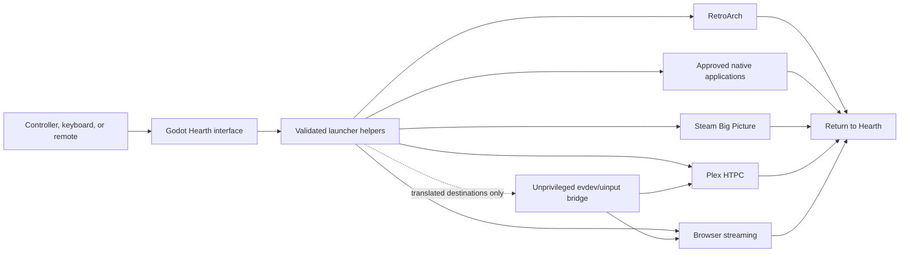

# Hearth architecture and trust boundaries

Hearth is a local Linux appliance interface. Godot owns presentation and controller navigation; bounded helpers own process launch details; destination applications own their native UI. The launcher never treats user JSON as a shell command.

## Component responsibilities

| Component | Owns | Does not own |
| --- | --- | --- |
| Godot launcher | Menus, library scan, artwork selection, atomic UI settings, child lifecycle, diagnostic rendering | Shell evaluation, credentials, device permissions |
| Filesystem library | User-controlled hierarchy, `icon.*`, `wallpaper.*`, ROM sidecars | A database or cloud inventory |
| Launcher helpers | One narrowly defined destination or allowlisted game ID | Arbitrary JSON commands |
| Input policy and bridge | Semantic actions, destination adapter, allowlisted key taps, cleanup | Root privileges, text injection, Steam/RetroArch native input |
| Fedora deployment | Root-owned application files, active-user uinput ACL, user service | ROMs, BIOS, saves, credentials, browser profiles |
| Doctor/System Health | Status, counts, short remediation, privacy-redacted display | Personal filenames, media inventory, secrets, arbitrary probes |

## Trust boundaries

- ROMs remain below `/srv/library/games/roms`; the RetroArch helper rejects paths outside that root.
- Libretro cores must be installed in an approved directory and named in the source-controlled registry.
- Native PC games launch only through approved helpers below `/opt/hearth/launchers`; manifest arguments do not become shell.
- Streaming and Plex output is limited to semantic actions mapped to allowlisted virtual keys.
- The input bridge is short-lived, releases grabs on exit/failure, and never runs as root.
- Personal content, local settings, service credentials, and browser profiles remain outside the repository.
- The System Health UI reads a sanitized allowlist and can invoke only `/opt/hearth/launchers/system-health-refresh.sh`.

See the [variable matrix](variable-matrix.md) for configuration contracts and [troubleshooting](troubleshooting.md) for operational recovery.
